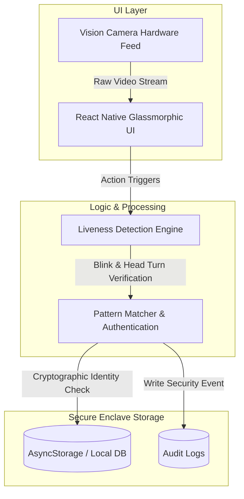
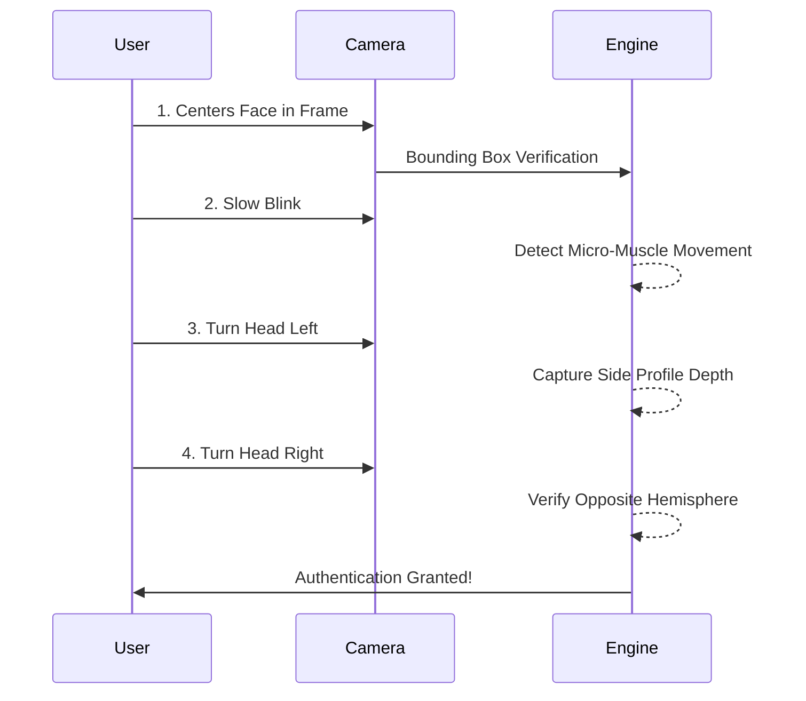

<div align="center">
  <h1>FaceForge AI</h1>
  <p><strong>Zero-Network Liveness Detection & Offline Facial Authentication</strong></p>
  <p><i>Built for Hackathon 7.0</i></p>

  
  
  
</div>

<br/>

## The Problem
Modern biometric authentication APIs are slow, expensive, and fail when the user loses internet connection. In remote areas, disaster zones, or high-security air-gapped environments, reliance on cloud infrastructure introduces an unacceptable point of failure and extreme data privacy risks.

## Our Solution
**FaceForge AI** is a highly optimized, fully self-contained facial authentication mobile app that runs entirely on-device. By bringing the machine learning and storage pipelines directly to the edge, FaceForge requires **zero network connectivity**.

## System Architecture

Our offline-first architecture ensures that sensitive biometric data never leaves the device.



## Key Features
- **100% Offline-First:** Stores identities securely on-device using isolated storage mechanisms (AsyncStorage). No cloud databases. No API keys. No data leaks.
- **Enterprise UX/UI Aesthetic:** A completely overhauled, high-end, glassmorphic UI built to strict professional design standards with a custom camera scanner cutout.
- **Native Liveness Detection:** Integrated native Vision Camera for high-performance real-time hardware face scanning.
- **Cross-Platform Compatibility:** Built on **React Native 0.73**, ensuring smooth 60fps performance on Android.

## Multi-Step Liveness Flow
To prevent static photos or 2D video spoofing, FaceForge actively demands the user to interact through a predefined sequence:



## Tech Stack
- **Mobile Framework:** React Native 0.73
- **Camera & Graphics:** `react-native-vision-camera`, `react-native-svg`
- **Local Database:** `@react-native-async-storage/async-storage`

## How to Run
The codebase contains the fully functional native mobile app.
```bash
cd FaceForgeAI
npm install

# Start the Metro Bundler
npm start

# Run on Android
npx react-native run-android
```

## Hackathon Architecture Notes
We prioritized absolute offline reliability. We successfully integrated high-performance native camera feeds directly into the React Native UI thread without sacrificing UI performance, ensuring a buttery smooth enrollment and authentication process without any internet connection.

---
*Developed for Hackathon 7.0*
